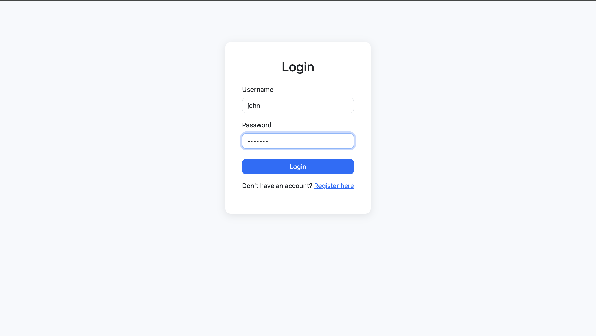
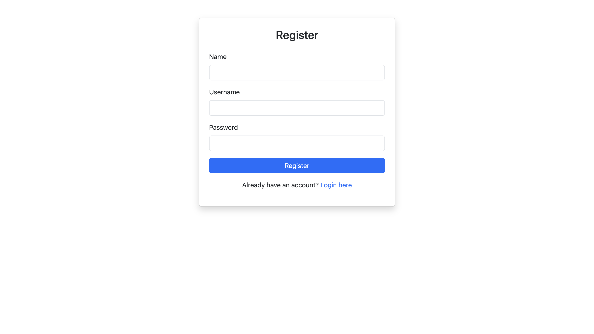
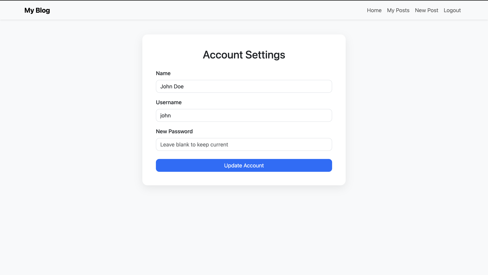
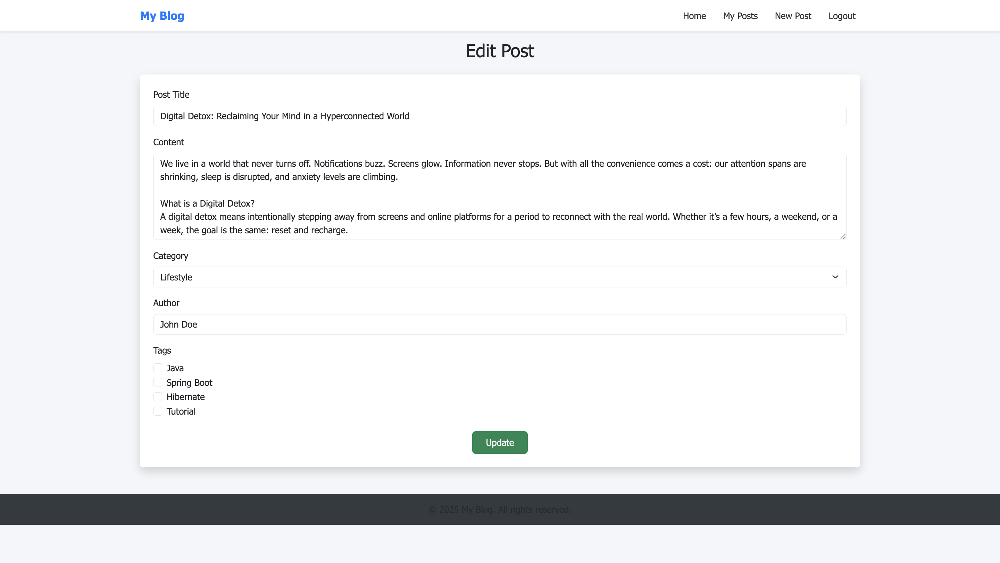
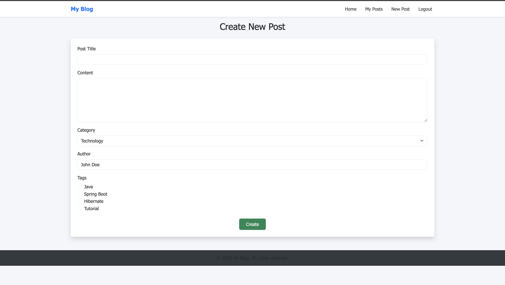
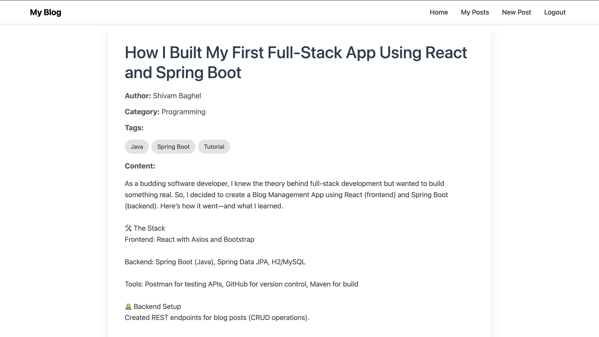
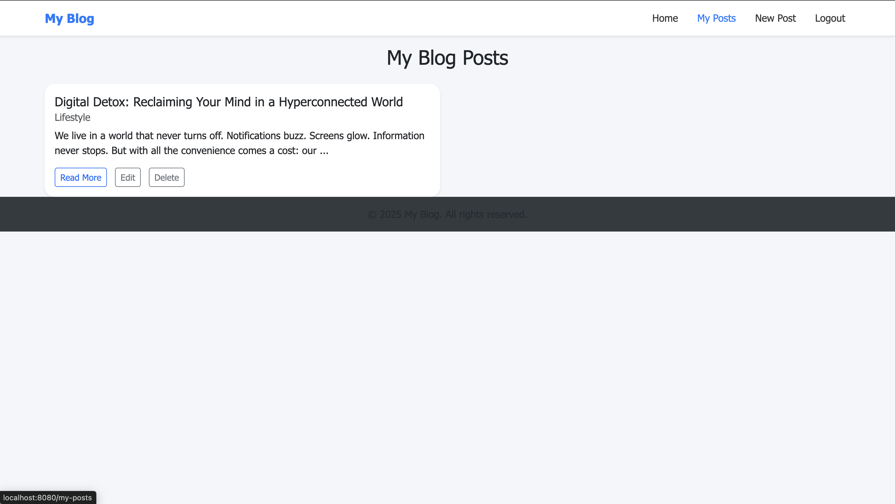

# 📝 Personal Blog Site

A modern and secure "My Blog" application built using **Spring Boot**, **Thymeleaf**, and **MySQL**. This project demonstrates full-stack web development with **authentication**, **user-post relations**, and **category-based content organization**.

---

## 🚀 Features

- 🔐 **User Authentication**
  - Register & Login functionality
  - Session-based access control
- ✍️ Create, edit, and delete blog posts
- 📚 Categorize posts with many-to-one relationship
- 👤 Posts linked to their authors (user-post one-to-many)
- 📅 Timestamps for post creation
- 🌐 Clean and responsive UI using Bootstrap 5

---

## 🔒 Authentication

- Only registered users can create/edit/delete posts
- User sessions are maintained using Spring MVC’s `HttpSession`
- Logged-in user info is injected into Thymeleaf views

---

## 🧠 Database Relationships

This app demonstrates **multiple table relationships**:

| Entity     | Relationship                    |
|------------|----------------------------------|
| `User`     | 🔗 1:N with `Post` (author posts) |
| `Post`     | 🔗 N:1 with `Category`            |
| `Category` | 🔗 1:N with `Post`                |

## 📸 Screenshots















## 🧪 Tech Stack

| Layer        | Tech                           |
|-------------|---------------------------------|
| Backend      | Spring Boot, Spring MVC, Spring Security         |
| Frontend     | Thymeleaf, HTML, Bootstrap      |
| Database     | MySQL / H2                      |
| ORM          | Spring Data JPA + Hibernate     |
| Build Tool   | Maven                           |

---

## ⚙️ Getting Started

### 1. Clone the repository

```bash
git clone https://github.com/ShiBag/my-blog.git
cd my-blog
```

### 2. Configure the database
Update the credentials in src/main/resources/application.properties

### 3. Build & run
mvn clean install
mvn spring-boot:run

Then visit:
http://localhost:8080


✨ Author

👨‍💻 Developed by Shivam Baghel

📫 Contact: shivambaghelaug@gmail.com

LinkedIn: https://www.linkedin.com/in/shivam-baghel-897935220/


